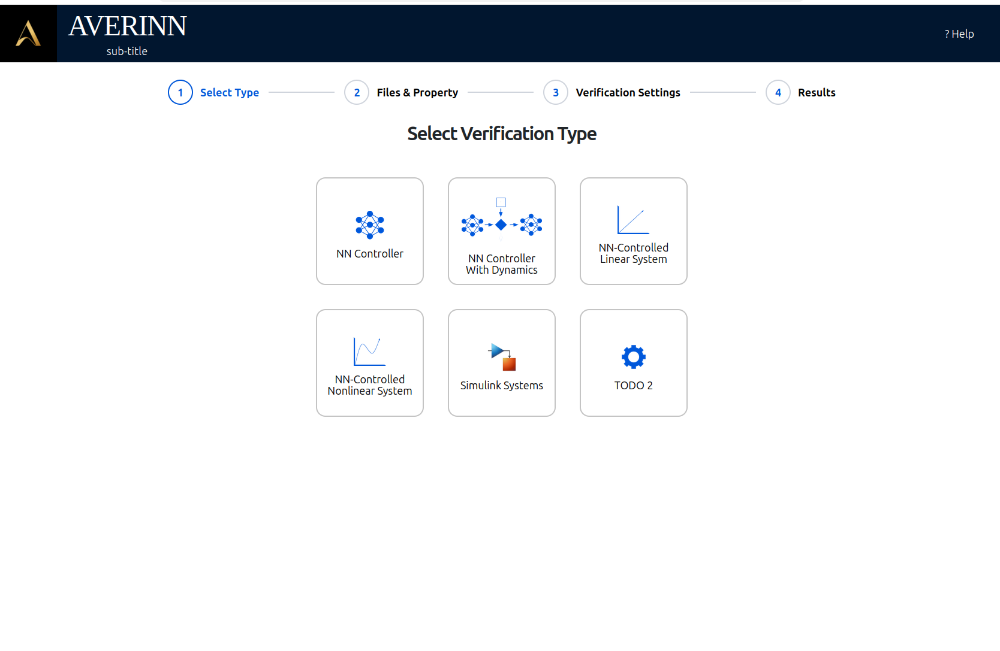
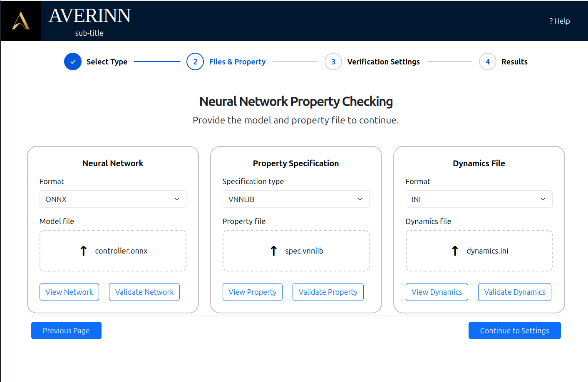
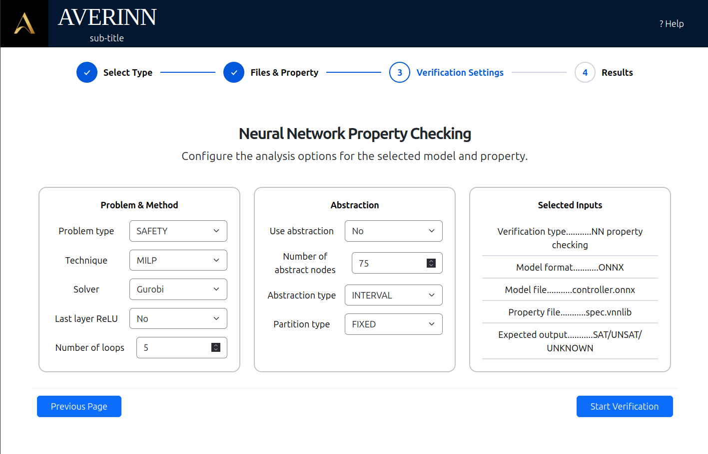
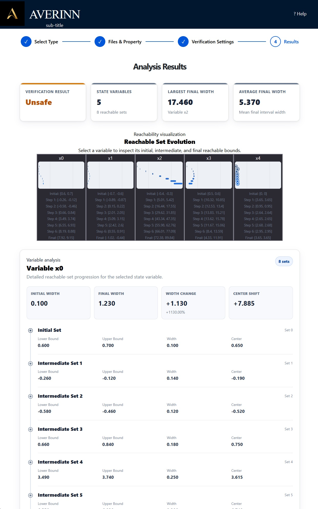

# AVERINN Web Interface

A browser-based user interface for the AVERINN neural network verification framework.

## Overview

AVERINN is a formal verification tool for proving safety properties of artificial neural network controllers. The tool is powerful but currently exists only as a command line interface program. This project aims to create a more intuitive graphical user interface using a React-FastAPI stack, allowing researchers and engineers to configure, run, and visualize verifications on their own without having to interact directly with it through a terminal.
<p>The project is being developed as part of a National Science Foundation Research Experiences for Undergraduates (REU) program at the University of New Mexico.</P>

## Project Goals

The browser interface aims to:
- Simplfy execution of AVERINN verification jobs
- Automatically create custom configuration files based on user selections
- Support multiple verification types/workflows
- Validate user inputs before execution
- Allow user to upload networks, dynamics, and spec sheets
- Display verification results in a clean, user-friendly format
- Reduce learning curve for new users of the framework

## Current Features

- React-based frontend
- FastAPI backend
- Automatic configuration file generation
- Support for dynamic and non-dynamic verification modes
- File uploads via frontend
- Parameter selection via frontend
- Safeguards that prevent unsupported files from being uploaded
- Execution of the AVERINN engine
- Result parsing and presentation

## Tech Stack

### Frontend

 - React
 - Javascript
 - HTML
 - CSS
 - Bootstrap

 ### Backend

 - FastAPI
 - Python

 ### Verification engine

 - AVERINN
 - Sample networks, configs, and benchmark files

 ## Current Status

This project is currently under active development.

New features are being added as part of ongoing research into improving the usability of the verification tool.

## Screenshots









## How to Run

These instructions assume you are starting from a fresh clone of the repository.

### 1. Clone the repository

```
git clone ,repo-url>
cd <repo-name>
```

### 2. Set up the Python backend

From the project root, create and activate a virtual environment:

```
python3 -m venv .venv
source .venv/bin/activate
```

Install the backend dependencies:

```
pip install --upgrade pip
pip install fastapi uvicorn python-multipart
pip install -r requirements.txt
```

Start the backend server:

```
cd backend
uvicorn main:app --reload
```

### 3. Set up the React frontend

Open a second terminal and navigate to the frontend directory:

```
cd frontend
```

Install the Node dependencies:

```
npm install
```

Start the Vite development server:

```
npm run dev
```

The frontend should now be running locally. Vite will print the local address in the terminal. Copy that address into your browser to use the interface.

### 4. Development notes

The backend and frontend need to run at the same time in separate terminals.

The node_modules/ folder is intentionally omitted from the repo. It will be recreated locally with

```
npm install
```

The Python virtual environment is also not included in the repo. It will be recreated locally with

```
python3 -m venv .venv
```

### 5. Using the interface

- Select verification type
  - Note: only dynamic and non-dynamic verifications are active, more modes are being implemented
- Upload your desired network file and specifications sheet (and dynamics file, if applicable) before advancing
- Configure analysis options for the verification run
- Click "Start Verification" to run the tool with your selected settings and network file

## Future Development

Planned future improvements include:

- Rework "Selected Inputs" to reflect actual uploads
- Add model visualizer to upload card
- ~~Better visualization of results~~
- Progress report during verification
- ~~Button lockout while tool is currently running~~
- Options to run various tool types (linear, hybrid, etc)
- Improved error reporting

## Acknowledgements
This interface is built on top of the existing AVERINN verification framework. I have not made any contributions to the engine itself.

## License

This repo currently contains work developed for academic research.

Please consult the original AVERINN project (github.com/ratanlal02/AVERINN) regarding licensing before attempting to redistribute or incorporate the underlying framework into other projects.